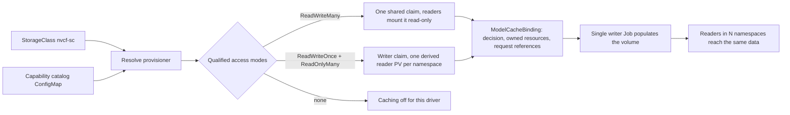

# SDD: Storage-Agnostic Model Cache

## Goal

Make NVCA model caching work on any storage backend that supports a minimum set
of PVC access modes, and make enabling a backend a data change rather than a
code change. Today NVCA picks a backend by StorageClass name, and the NVMesh
path has its provisioner, mount options, and namespace rewriting compiled in.

## How it fits together



Four pieces:

1. StorageClass contract. Deployment tooling renders one provider as
   `StorageClass/nvcf-sc` with reclaim policy `Retain`. NVCA reads only its
   provisioner.
2. Capability catalog. Per exact CSI provisioner, the access modes qualified in a
   cache workflow and the mount options for reader PVs NVCA creates. NVCA derives
   the flow; the catalog declares none.
3. Cache binding. One `ModelCacheBinding` per shared cache records the decision,
   the resources it owns, and the requests using it. A later catalog edit never
   changes a live cache.
4. Derived readers. A reader PV is derived from the writer's bound volume, never
   provisioned from the class.

## Terms

| Term | Meaning |
|---|---|
| Provisioner | Exact `StorageClass.provisioner` string, the catalog key |
| Workflow | `regularModelCache` (readers in the request namespace) or `helmModelCache` (readers in other namespaces) |
| Flow | How a cache moves from writer to readers, derived from access modes: `rwxReadOnly` or `roxReadOnly` |
| Cache handle | Content hash identifying one model cache |
| Writer | The single Job that populates a cache, serialized by a Lease |
| Reader | A namespace-local read-only volume onto the same data |

## Capability catalog

Installed by the NVCA chart as ConfigMap `nvcf-storage-capabilities`, validated
by a packaged JSON Schema and by the Go loader with the same rules.

```yaml
drivers:
  - name: nvmesh-csi.excelero.com
    provider: nvmesh
    accessModes: [ReadWriteOnce, ReadOnlyMany]
    readerMountOptions: [ro, norecovery, nouuid]
    encryptionSupported: true
  - name: csi.weka.io
    provider: weka
    accessModes: []
    readerMountOptions: []
```

Drivers are a list named by exact provisioner, following Kubernetes API
conventions for stable ordering and diffs; the loader indexes them by name and
rejects duplicates. `encryptionSupported` records that an encrypted cache has
been qualified on the driver. It is a capability, not a switch: the
`ModelCacheEncryption` feature flag decides whether to encrypt, and only a
driver that lists support can be. Today only the `ReadWriteOnce` plus
`ReadOnlyMany` shape implements encryption.

The catalog is a ConfigMap rather than a custom resource because it is release
data, not runtime state: the chart ships it, a JSON schema validates it in CI,
nothing reconciles or writes it on a cluster, and an operator edits it to enable
a backend. A custom resource would add install ordering and a schema version to
manage for a file. The cache binding, which is runtime state with a lifecycle,
is the custom resource.

| Qualified modes | Derived flow |
|---|---|
| `ReadWriteMany` | `rwxReadOnly`: one shared claim, readers mount it read-only |
| `ReadWriteOnce` and `ReadOnlyMany` | `roxReadOnly`: writer takes the claim, each namespace gets a reader PV derived from its volume |
| empty | off |

Two rules, enforced by schema and validator alike:

- The `ReadWriteOnce` plus `ReadOnlyMany` shape must list `ro`. NVCA creates
  those reader PVs and must mount them read-only.
- `ReadOnlyMany` with no writer mode is rejected. Nothing would populate the cache.

Everything else is data. `norecovery` and `nouuid` are NVMesh XFS requirements
recorded on the NVMesh entry only. `provider` is a label for diagnostics and
gates nothing. Helm caching must cross namespaces: `ReadWriteMany` does so
natively; `roxReadOnly` does so only on NVMesh, whose volume handle encodes the
consuming namespace and is rewritten per reader.

## Cache binding

`ModelCacheBinding` (`nvca.nvcf.nvidia.io/v2beta1`) is namespaced in
`nvca-modelcache-init`, one per shared cache.

| Field | Records |
|---|---|
| `spec.identity` | Workflow, sharing-domain digest, cache-handle digest |
| `spec.decision` | Provider, provisioner, derived flow, required access modes, catalog profile digest |
| `spec.storageClass` | Name, UID, `Retain`, configuration digest |
| `spec.resources` | Names of the PVCs, PVs, Jobs, StorageClasses, Secrets, and Lease it owns |
| `status.requestReferences` | Namespace, name, and UID of each request using it |
| `status.phase` | `Active` or `Retiring` |

The API server enforces: `spec` is immutable, `Retiring` never returns to
`Active`, a recorded data identity never changes. A finalizer protects owned
resources until they are released.

Why an object and not annotations:

- Lifetime. The decision must outlive every request. A request annotation dies
  with its request; the binding lives as long as the cache.
- Identity per referrer. A timestamp cannot tell an idle cache from one held by
  a request that died without cleanup. UID references can. Zero references is
  the idle condition.
- Enforcement. Immutability and phase rules are rejected by the API server. A
  bad annotation write is accepted silently.

Lifecycle, in the runtime design: a binding with zero references past the idle
period moves to `Retiring`, the resources it names are deleted, and the
finalizer is dropped. Nothing it does not name is touched. Uninstall strips binding finalizers before
deleting the control namespace, and stops if it cannot, so the uninstall can be
retried instead of leaving the namespace Terminating.

## Readers

Every reader is a static PV pre-bound to a claim by name. The PV is a copy of
the writer's PV with: `storageClassName` cleared (a pre-bound pair whose classes
differ never binds), `csi.readOnly: true` (access modes are not enforced at
mount time), and `mountOptions` resolved per provisioner from the
`nvca-cache-mount-options` ConfigMap. The catalog's `readerMountOptions` is the
intended source for those options and is validated, but no reader code reads it
yet. Only the volume handle differs by driver: NVMesh rewrites the namespace
segment; every other driver reuses the writer's handle unchanged.

A reader claim that names only a StorageClass gets a new empty volume from a
dynamic provisioner. It binds, the pod starts, and the model is missing. That
was the previous shared-filesystem reader.

## Runtime flow

1. Gate on `CachingSupport` and `HelmModelCaching`. Persist `none` or
   `ephemeral` when selected; no binding.
2. Read `StorageClass/nvcf-sc`, require `Retain`, load the catalog, derive the
   flow from the provisioner's entry. No derivable flow: no durable cache.
3. Get or create the binding for (workflow, sharing domain, cache handle). A
   `Retiring` binding is never joined.
4. Add the request reference and persist the binding name and UID on the
   request before any storage side effect.
5. Run the flow: Lease elects one writer; readers derive from the writer's PV.
6. Catalog, feature-gate, and StorageClass changes after step 4 never alter the
   binding. NVCA never switches a live cache to another provider.

Steps 1 and 2 and persisting the selection on the request are implemented.
Steps 3, 4, and 6 land with the binding controller.

## What runs today

Public `main` selects by StorageClass presence: `nvcf-sc-30` present selects
NVMesh; `nvcf-miniservice-sc` present selects the shared-filesystem path;
`HelmSharedStorage` enabled with the model cache class present selects a Samba
re-export of an `nvcf-sc` volume; otherwise a per-pod `emptyDir` with an init
download. That is the path for a request with no persisted selection. A new
request carries a selection derived from the catalog when it is created, and
Helm backend selection follows it; the regular workflow records it but does not
act on it yet. No controller creates a binding. Garbage collection is an idle
sweep keyed on a last-referenced annotation. The mutating webhook
injects the reader PVC into workload pods as a volume named `model-data`.

## Qualification

A driver's advertised modes are not evidence, and a claim that binds is not
evidence. A run must show, on the exact provisioner and class:

1. A writer populates a claim and the data survives the writer exiting.
2. A reader in another namespace sees identical bytes (compare a hash).
3. Writes from a reader fail with `EROFS`: create, append, rename, chmod,
   truncate, delete. A `ro` mount flag alone is not proof.
4. Reclaim policy is `Retain`.

Measured on a Weka cluster and an OCI File Storage (FSS) cluster, 16 MiB
payload, SHA-256 compared:

| Reader | Weka | OCI FSS |
|---|---|---|
| Static PV on the writer volume, RWX claim, other namespace | hash matches, writes `EROFS` | hash matches, writes `EROFS` |
| Static PV on the writer volume, ROX claim, other namespace | hash matches, writes `EROFS` | hash matches, writes `EROFS` |
| Fresh dynamic claim on the same class | new volume, empty | new export, empty |

Both qualify for `ReadWriteMany` and `ReadOnlyMany` by the same mechanism.
Their catalog entries stay empty until a full cache workflow, not a synthetic
writer, has run on each. OCI Lustre is registered but unmeasured. FSS notes:
its driver declares `fsGroupPolicy: ReadWriteOnceWithFSType`, so a non-root
writer gets `EACCES` on a fresh export, and its stock classes use `Delete`, so
a `Retain` class must be created for the cache.

## Failure rules

| Event | Result |
|---|---|
| Catalog, class, or gate changes after the binding exists | Binding stays authoritative |
| Class or catalog drifts before the binding exists | Fail before any side effect |
| Binding is `Retiring`, missing, or lacks this request's reference | Fail; never rebind |
| Object has foreign or missing ownership | Never adopt or delete it |
| Reader PV and claim disagree on class | Never binds; prevented by construction |
| Transient API error | Requeue without changing state |

Configuration drift never authorizes data deletion.

## Enabling a provider

1. Run the qualification on the exact provisioner and class.
2. Set the entry's `accessModes` to what the run proved, nothing more.
3. Set `readerMountOptions` if NVCA creates reader PVs for it; `ro` is required.
4. Regenerate the vendored chart so both catalog copies match.
5. Cite the run in the commit.

No code change should be needed. If one is, the catalog is missing a fact.

## Source references

- [Catalog](https://github.com/NVIDIA/nvcf/blob/main/src/compute-plane-services/nvca/deployments/nvca-operator/files/nvcf-storage-capabilities-v1alpha1.yaml)
- [Catalog schema](https://github.com/NVIDIA/nvcf/blob/main/src/compute-plane-services/nvca/deployments/nvca-operator/files/nvcf-storage-capabilities-v1alpha1.schema.json)
- [Catalog loader and validator](https://github.com/NVIDIA/nvcf/blob/main/src/compute-plane-services/nvca/pkg/storage/storage_capabilities.go)
- [Backend selection on main](https://github.com/NVIDIA/nvcf/blob/main/src/compute-plane-services/nvca/pkg/storage/cachebackend.go)
- [Runtime work](https://github.com/NVIDIA/nvcf/issues/1326)
