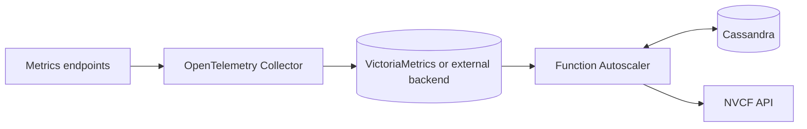

# Function Autoscaling

The NVCF Function Autoscaler reads function metrics, calculates a desired
instance count, and sends that count to the NVCF API. It runs in the
self-hosted control-plane cluster.

## Function Autoscaler vs Horizontal Pod Autoscaler

Function autoscaling is distinct from Kubernetes horizontal pod autoscaling
(HPA). HPA scales a Kubernetes workload in one cluster. The Function
Autoscaler sets the desired instance count for an NVCF function version, which
can run across NVCF compute clusters.

## Key Functionality

- Discovers active functions from control-plane request metrics in the
  timeseries database and persists the active set in Cassandra.
- Periodically computes a desired instance count per function from recent
  utilization and the function's scaling policy.
- Applies the desired count by calling the NVCF API's predictions endpoint.
- Coordinates work across replicas using hash-based bucket assignment and
  Cassandra lightweight transaction (LWT) locks.

## Self-hosted deployment

The self-managed control-plane stack defaults to the `control` observability
profile. The `control` and `all` profiles install the Function Autoscaler. The
`compute` and `disabled` profiles do not.

State Metrics must be enabled for `control` and `all`. With the default
component modes, the control-plane stack also installs the shared collector and
VictoriaMetrics. See [Observability Configuration](../observability.md) for
profile and backend settings.

## Architecture Overview

See [Architecture](./architecture.md#sequence-diagram) for the end-to-end
sequence and bucket model.

## See Also

- [Architecture](./architecture.md) for components, data flow, and the Cassandra LWT lock behavior that elects the discovery leader.
- [Configure Autoscaling](../configure-autoscaling.md) for setting per-function scaling bounds, factors, thresholds, and stickiness via the NVCF API.
- [Function Autoscaler Operations](./operations.md) for health endpoints and operational guidance.
- [Function Autoscaler Observability](./observability.md) for the metrics, traces, and logs emitted by the service.
- [Observability Configuration](../observability.md) for profiles and metrics backend configuration.
