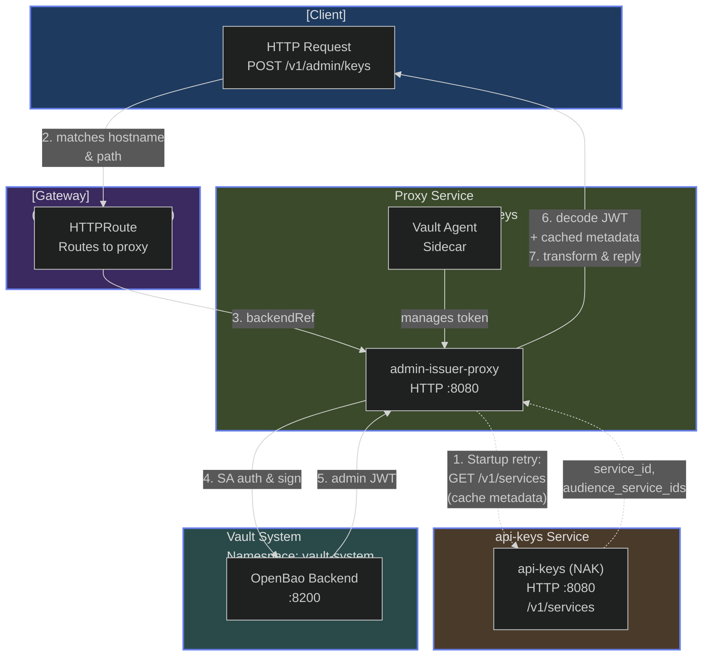

# Admin Issuer Proxy

A portable HTTP service that mints admin-scoped JWTs from Vault/OpenBao and returns them in a standardized format. Designed as an intermediary drop-in component, it allows systems to obtain admin JWTs in a standardized way until NAK/API natively supports this functionality. The service can be cleanly removed with minimal changes once the underlying platform provides the required feature.

## Architecture

The service follows a simple request flow:

**Startup:**

1. Proxy starts its liveness and readiness endpoints
2. Proxy fetches service metadata from api-keys and retries transient cold-start failures with capped exponential backoff
3. Readiness becomes successful after the metadata is cached

**Request Flow:**

1. Client sends `POST /v1/admin/keys` request
2. Gateway (Envoy or any HTTP proxy) routes to the proxy service
3. Proxy reads Vault token from file (provided by Vault Agent sidecar)
4. Proxy calls Vault's sign endpoint to mint the admin JWT
5. Proxy decodes JWT claims and combines with cached service metadata
6. Proxy transforms the response to match the api-keys response format
7. Client receives the admin JWT in the standardized response



## Features

- **Portable**: Works with any HTTP gateway (Envoy, Kong, Traefik, etc.)
- **Secure**: Uses Vault Agent for token management; no credentials in application code
- **Simple**: Single service handles all logic; no complex filter chains
- **Maintainable**: Clean Go codebase following standard project layout
- **Testable**: Unit tests cover the core request, Vault, metadata, and retry behavior
- **API-Compatible**: Response format matches api-keys service for seamless integration
- **RFC 7519 Compliant**: Handles JWT `aud` claim as both string and array per specification

## Project Structure

```text
/
├── cmd/
│   └── admin-issuer-proxy/
│       └── main.go              # Application entry point
├── internal/
│   ├── config/
│   │   └── config.go            # Configuration management
│   ├── handlers/
│   │   ├── handlers.go          # HTTP handlers
│   │   └── handlers_test.go     # Handler tests
│   ├── models/
│   │   ├── models.go            # Data models and JWT claims
│   │   └── models_test.go       # Model tests
│   ├── servicecache/
│   │   ├── cache.go             # Service metadata cache
│   │   └── cache_test.go        # Cache tests
│   └── platform/
│       └── vault/
│           ├── client.go        # Vault client wrapper
│           └── client_test.go   # Vault client tests
├── docs/
│   └── non-admin-key-sample.json # Sample response format
├── BUILD.bazel                  # Gazelle and top-level binary alias
├── go.mod
└── README.md
```

## Configuration

The service is configured via environment variables:

| Variable | Default | Description |
|----------|---------|-------------|
| `VAULT_ADDR` | Required | Vault server address |
| `SIGN_PATH` | Required | Vault mount path for JWT signing |
| `ROLE` | `admin-issuer-proxy` | Role name to append to SIGN_PATH |
| `VAULT_TOKEN_FILE` | `/vault/secrets/token` | Path to Vault token file (from Agent) |
| `LISTEN_ADDR` | `:8080` | HTTP server listen address |
| `SERVICE_METADATA_URL` | Required | URL to fetch service metadata (cached at startup) |

## Service Metadata Caching

At startup, the service fetches metadata from the api-keys service (`/v1/services` endpoint) and caches it in memory. This metadata includes:

- `service_id`: The service identifier used in response fields
- `service_name`: Human-readable service name
- `audience_service_ids`: Default audience values for the service

The cached metadata is used to populate response fields:

- `issuer_service_id`
- `audience_service_ids`
- `authorizations.policies[].aud` and `auds`

**Startup Behavior:**

- The process remains live and retries connection failures, HTTP 408/429 responses, and HTTP 5xx responses using exponential backoff capped at 10 seconds
- Permanent responses such as authentication or configuration errors stop startup immediately with a clear error
- `/readyz` returns `503` until the first metadata fetch succeeds; token requests also return `503` without calling Vault while metadata is unavailable
- The cache is **never refreshed** during runtime (only at startup)

## JWT Claims Handling

The service decodes JWT claims from the minted token to extract:

- **`iat` (issued at)** → `created_at` timestamp
- **`exp` (expiration)** → `expires_at` timestamp
- **`scopes`** → `authorizations.policies[].scopes` array
- **`sub` (subject)** → `owner_id` (defaults to `admin-issuer-proxy` if not present)

**RFC 7519 Compliance:**
The `aud` (audience) claim in JWTs can be either a string or an array per RFC 7519. The service parses both formats for compatibility, but does not validate or otherwise consume the decoded audience.

**Note:** The service decodes JWT claims only to populate `created_at`, `expires_at`, `scopes`, and `owner_id`. Response audience fields come from the cached service metadata to ensure consistency with the api-keys service format.

## API Endpoints

### POST /v1/admin/keys

Mints a new admin-scoped JWT token. The response format matches the api-keys service format for seamless integration.

**Request:**

```http
POST /v1/admin/keys HTTP/1.1
Host: admin-token.example.com
```

**Response:**

```json
{
  "id": "4wGSLuwww6fk2eUIidHpDJ",
  "value": "eyJhbGciOiJFUzI1NiIsImtpZCI6IjFZTGdKa2ZseTBqbEtIN0g3ajFjTUQyMnFMYyIsInR5cCI6IkpXVCJ9...",
  "status": "ACTIVE",
  "owner_type": "SYSTEM",
  "owner_id": "admin-issuer-proxy",
  "issuer_service_id": "example-service-id",
  "audience_service_ids": [
    "example-service-id"
  ],
  "description": "Admin token",
  "created_at": "2025-01-15T10:30:00Z",
  "expires_at": "2025-01-15T22:30:00Z",
  "authorizations": {
    "policies": [
      {
        "aud": "example-service-id",
        "auds": [
          "example-service-id"
        ],
        "product": "nv-cloud-functions",
        "resources": [
          {
            "id": "*",
            "type": "account-functions"
          },
          {
            "id": "*",
            "type": "authorized-functions"
          }
        ],
        "scopes": [
          "register_function",
          "list_functions",
          "list_functions_details",
          "deploy_function",
          "update_function",
          "update_secrets",
          "delete_function",
          "manage_telemetries",
          "manage_registry_credentials"
        ]
      }
    ]
  }
}
```

**Response Fields:**

- `id`: Unique identifier from Vault's request ID
- `value`: The JWT token itself
- `status`: Always `ACTIVE` for newly minted tokens
- `owner_type`: `SYSTEM` for admin tokens (not user-owned)
- `owner_id`: The service account subject from the JWT (`sub` claim), defaults to `admin-issuer-proxy`
- `issuer_service_id`: Service ID from cached api-keys metadata
- `audience_service_ids`: Service audiences from cached metadata
- `description`: Human-readable description
- `created_at`: Token creation time (ISO 8601 format)
- `expires_at`: Token expiration time (ISO 8601 format)
- `authorizations.policies`: Array of authorization policies
  - `aud`: Primary audience (service ID)
  - `auds`: Array of audience service IDs
  - `product`: Product identifier (`nv-cloud-functions`)
  - `resources`: Array of resource patterns (wildcards for admin)
  - `scopes`: Array of permission scopes from the JWT

### GET /healthz

Liveness check endpoint. This reports whether the HTTP process is running and
does not depend on api-keys startup.

**Response:**

```text
OK
```

### GET /readyz

Readiness check endpoint. This returns `503 Service Unavailable` until service
metadata has been fetched from api-keys, then returns `200 OK`.

## Deployment

Deploy this service with the chart at
`deploy/helm/admin-token-issuer-proxy`. The chart configures the service
account, projected Vault/OpenBao identity, gateway route, non-root security
context, and health probes.

The gateway must authenticate and authorize callers before forwarding
`POST /v1/admin/keys`. The application does not authenticate callers itself.

## Development

Run commands from the monorepo root:

```bash
go test ./src/control-plane-services/admin-token-issuer-proxy/... -count=1
go vet ./src/control-plane-services/admin-token-issuer-proxy/...
bazel test //src/control-plane-services/admin-token-issuer-proxy/...
bazel build //src/control-plane-services/admin-token-issuer-proxy/cmd/admin-issuer-proxy:image_index
```

Load a local-architecture image into Docker with:

```bash
bazel run //src/control-plane-services/admin-token-issuer-proxy/cmd/admin-issuer-proxy:image_load
```

Version, build time, and Git commit are stamped into release binaries. Check
them with the `--version` flag. Release tags use the monorepo path format
`src/control-plane-services/admin-token-issuer-proxy/vX.Y.Z`.

When you pull `registry.example.com/project:1.2.3`, Docker/Kubernetes automatically selects the image matching your platform:
```bash
# On amd64 node
docker pull registry.example.com/project:1.2.3
# Pulls: registry.example.com/project@sha256:amd64-digest

# On arm64 node
docker pull registry.example.com/project:1.2.3
# Pulls: registry.example.com/project@sha256:arm64-digest
```

**Inspect Multi-Arch Manifest:**
```bash
# With Buildah
buildah manifest inspect registry.example.com/project:1.2.3

# With Docker/Podman
docker manifest inspect registry.example.com/project:1.2.3
```
