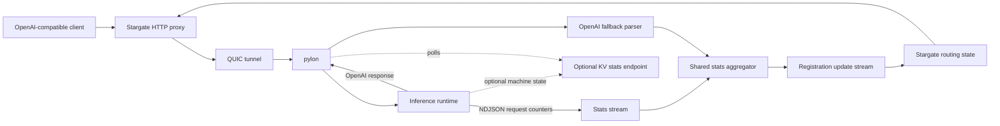

# Runtime Stats Interface

This document describes how inference runtimes surface live request throughput
to pylon, and how pylon publishes that data to Stargate for routing.

The primary engine-facing request throughput contract is a side-channel NDJSON
stream:

```text
GET /pylon/v1/stats/stream
Accept: application/x-ndjson
```

The stream is separate from OpenAI-compatible inference responses. Pylon keeps
client response bodies free of private stats frames, strips legacy private
`x-pylon-engine-stat-*` response headers, and uses OpenAI chunk metadata only as
a fallback when the engine stats stream is unavailable or disabled.

## Goals

- Keep inference responses OpenAI-compatible and free of private stats frames.
- Keep the runtime contract simple enough for a Dynamo worker or frontend to
  implement from request IDs and streaming usage counters.
- Derive request-local deltas inside pylon from cumulative per-request counters.
- Use one shared aggregation path for engine stream counters and OpenAI fallback
  counters.
- Keep runtime queue internals and KV-cache machine state out of the v1 stream
  contract.
- Publish capability and source labels so Stargate can reason about stats
  fidelity.

## Architecture



Pylon observes two data classes through separate surfaces:

- Request throughput stats: per-request cumulative input and output counters.
- Optional machine-state stats: KV-cache capacity and occupancy over the legacy
  HTTP polling endpoint.

These surfaces remain separate because Dynamo-style request handlers can
reasonably know request IDs and usage counters, but generic runners usually do
not have a stable, engine-agnostic view of internal queues or KV-cache
occupancy.

## Engine Stats Stream

Each non-empty line is a JSON object. All events include `v: 1` and `type`.
Malformed lines are dropped, counted in
`pylon_engine_stats_stream_invalid_events_total`, and do not close the stream.

### Request Stats

Request stats events are cumulative per request:

```json
{
  "v": 1,
  "type": "stats",
  "request_id": "req-123",
  "model": "llama",
  "tokens_processed": 128,
  "tokens_generated": 17,
  "finished": false
}
```

Rules:

- `request_id` and `model` are required and must be non-empty strings.
- `tokens_processed` and `tokens_generated` are optional unsigned integer
  cumulative counters. At least one counter is required unless `finished` is
  true.
- `tokens_processed` is the cumulative input/prefill work completed for that
  request. The runner can emit it when it knows the request has completed
  prompt processing; it does not need to continuously compute input TPS.
- `tokens_generated` is the cumulative output/decode token count for that
  request. Runners should emit updates as often as their output loop naturally
  observes new generated tokens.
- Pylon computes request-local deltas. Duplicate or regressing counters are
  ignored.
- A `finished: true` event finalizes request-local state. Later events for that
  request are ignored.
- Input-rate samples update sticky `last_mean_input_tps` only after the shared
  distribution has enough valid samples. Until then, the last published value is
  retained.
- Output deltas update `output_tps` and `max_output_tps` for generation
  endpoints.

This mirrors what Dynamo already exposes around request output handling:
request identity plus cumulative `prompt_tokens` / `completion_tokens` style
usage. It does not require the runtime to expose internal queue state.

### Ping

```json
{"v":1,"type":"ping"}
```

Ping events keep idle streams active. They do not publish model stats.

## Source Selection

Pylon exposes:

```text
--engine-stats-stream=auto|required|off
--engine-stats-stream-path=/pylon/v1/stats/stream
```

Modes:

- `auto`: connect to the stream with OpenAI fallback stats disabled. If the
  endpoint returns an unsupported status such as `404`, `405`, or `501` before
  any valid stream event, pylon enables OpenAI chunk parsing for route-facing
  stats. Transient connection errors, `5xx`, malformed events, and EOF retry the
  stream instead of changing source.
- `required`: keep reconnecting and report connection failures; this mode is for
  deployments where engine stream stats are mandatory. OpenAI fallback stats
  stay disabled.
- `off`: do not connect to the engine stats stream. OpenAI chunk parsing remains
  the request-stats fallback.

The legacy `--engine-stats-contract` flag still controls mock/test defaults such
as `/kv-cache/stats` polling. It does not define the v1 stream shape.

## OpenAI Fallback

When the engine stream is unavailable or disabled, pylon can derive output
counters from OpenAI SSE `data:` JSON:

```json
{"usage":{"completion_tokens":12}}
```

and:

```json
{"output_tokens_so_far":12}
```

Those fallback counters feed the same shared stats aggregator used by the engine
stream. Text peeking remains a best-effort fallback for engines that emit only
text deltas.

Tunneled `/v1/chat/completions` and `/v1/responses` requests must be valid JSON
with `"stream": true`; the tunnel rejects non-streaming bodies for those
stream-observed endpoints before forwarding upstream. `/v1/embeddings` accepts
valid non-streaming JSON and records input cardinality for pylon-local
embedding item metrics.

## Optional Machine-State Polling

KV-cache machine-state metrics are not part of `/pylon/v1/stats/stream`.
Existing mock and benchmark deployments may still expose:

```text
/kv-cache/stats
```

with:

```json
{
  "model": "model-a",
  "kv_cache_capacity_tokens": 1000,
  "kv_cache_used_tokens": 400,
  "kv_cache_free_tokens": 600
}
```

Pylon drops KV stats for unconfigured models when configured model IDs are
present. Successful polls mark the model with:

```text
machine.kv_cache.http
```

and:

```text
kv_cache_stats
```

This endpoint is intentionally separate from the Dynamo request-counter stream.
Real runtimes should implement it only when they already have a reliable,
engine-specific machine-state source.

## Aggregation

The shared stats aggregator owns cumulative-counter delta math, live request
state, terminal idempotency, source labels, output TPS derivation, and sticky
input-rate behavior. The collector coalesces published snapshots before
registration updates carry `ModelStats` to Stargate.

Request counter state is bounded by live request cardinality. A `finished: true`
stats event or request-runner terminal observation finalizes the request entry.
If neither terminal signal arrives, pylon removes stale request counter entries
after its configured request stats TTL; deltas already accepted from those
cumulative counters remain accounted, and cleanup does not invent additional
tokens.

Live request stats and output TPS are volatile. If request stats events go
stale, pylon clears live `output_tps`; sticky `last_mean_input_tps` is retained
until a later valid input-rate sample replaces it. Queue size, queued input
tokens, total active query input size, input-processing count, and
output-generation count are derived from pylon's request lifecycle observer, not
from the engine stats stream.

Pylon derives:

- current output TPS for streaming generation endpoints
- sticky completed-request mean input TPS, published as `last_mean_input_tps`
- max observed output TPS for streaming generation endpoints
- input-processing request count from pylon request lifecycle state
- output-generation request count from pylon request lifecycle state
- queue size and queued input tokens from pylon request lifecycle state
- total active query input size from pylon request lifecycle state
- optional KV-cache capacity, used tokens, and free tokens from `/kv-cache/stats`

For shared clusters, Stargate sums backend-scoped request load and
`last_mean_input_tps` capacity across active backends, unions capability/source
labels, and keeps the newest observation timestamp.

## Capability Labels

Current labels:

```text
request.final_headers
request.output.chunk_usage
machine.kv_cache.http
model.throughput.engine_stream
```

Current sources:

```text
request_metadata
chunk_usage
kv_cache_stats
engine_stats_stream
```

These labels are sticky within a pylon process for each model metrics state.
They describe which contract surfaces have been observed from the backend, not
which surfaces the most recent single request exercised.

## Metrics

The engine stream listener records:

```text
pylon_engine_stats_stream_events_total{type}
pylon_engine_stats_stream_invalid_events_total{reason}
pylon_engine_stats_stream_reconnects_total{reason}
pylon_engine_stats_stream_connected{mode}
pylon_engine_stats_live_requests{source}
pylon_engine_stats_model_states{source}
pylon_engine_stats_stale_cleanups_total{kind,source}
pylon_engine_stats_dirty_snapshots_total{source,reason}
pylon_engine_stats_source_transitions_total{from,to,reason}
```

The existing request and model stats metrics continue to record aggregated
tokens, throughput, queue state, phase counts, optional KV-cache polling state,
and source labels.

## Mock And Test Defaults

`mock-dynamo` implements the v1 stream by default:

- `/pylon/v1/stats/stream` emits NDJSON `stats` and `ping` events.
- Streaming chat and Responses bodies contain only public OpenAI-compatible SSE
  data.
- Streaming chunks omit `usage.completion_tokens` by default so tests exercise
  the engine stats stream instead of chunk fallback.
- `/v1/embeddings` emits deterministic non-streaming JSON and a terminal stats
  event.
- `/kv-cache/stats` remains available for legacy mock/benchmark machine-state
  polling.

Disable mock stats emission with:

```bash
mock-dynamo --engine-stats-contract off
```

Disable pylon's stream listener with:

```bash
pylon --engine-stats-stream=off
```

## Tests

Focused coverage includes:

- parsing valid and invalid `/pylon/v1/stats/stream` request-counter events
- deriving deltas from cumulative request counters
- ignoring regressing counters and post-finalize events
- stale request cleanup and stale live output TPS clearing without dropping
  sticky input TPS
- `auto`, `required`, and `off` source selection for OpenAI fallback stats
- sharing aggregator math between engine stream and OpenAI fallback counters
- forwarding legacy private SSE comments as ordinary response bytes
- stripping `x-pylon-engine-stat-*` response headers
- mock-dynamo NDJSON stream behavior
- pylon CLI source-selection defaults
- Stargate end-to-end registration, proxying, and engine-stream stats
